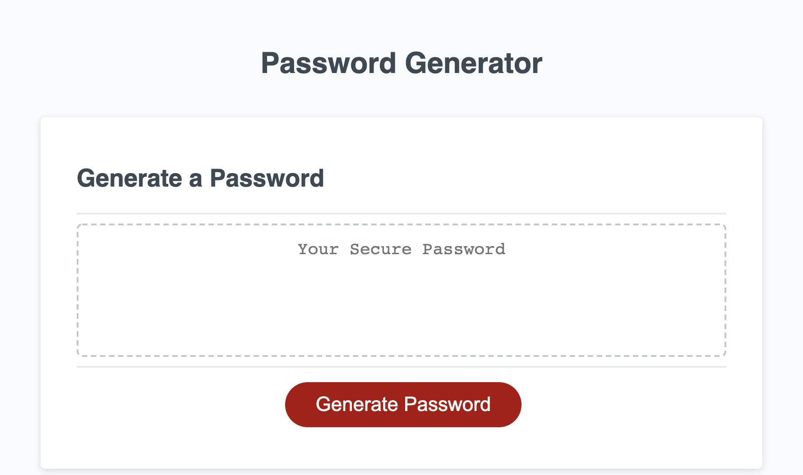
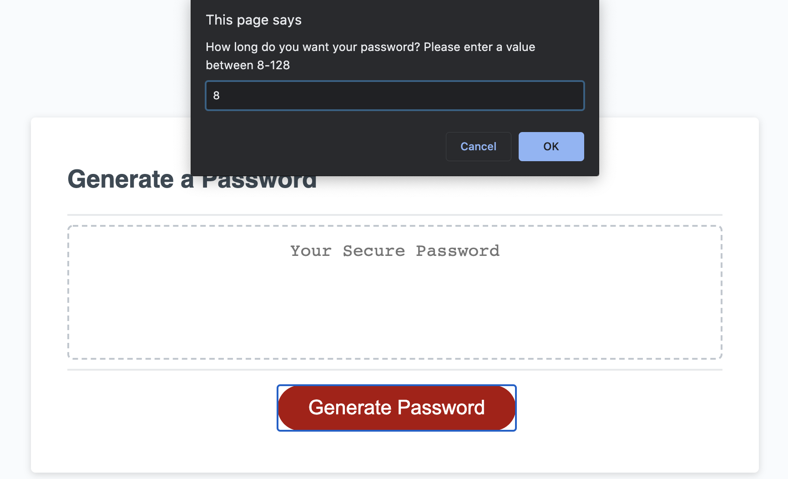
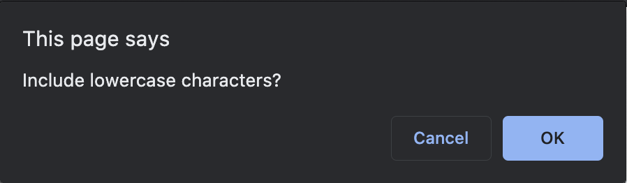
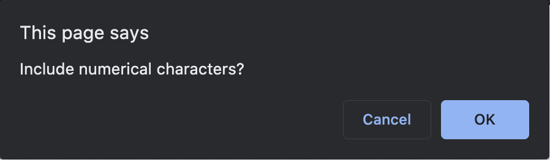
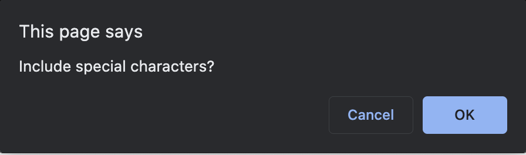
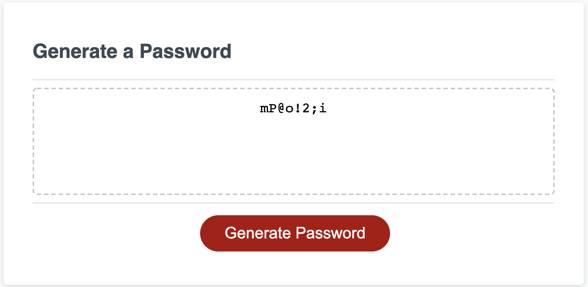

# Secure Password Generator
Code, the final frontier. These are the voyages of the programmer Muhammad. His continuing mission: to explore the strange world of programming, to seek out new tools and knowledge, to boldly go where no code has gone before.

-----------------------
## Table of Contents
1. [Description](#description)
2. [Deployed Link](#deployed-link)
3. [Walkthrough](#walkthrough)
4. [Code Snippet](#code-snippet)
5. [Prerequisites](#prerequisites)
6. [Installing Instructions](#installing-instructions)
7. [Built with](#built-with)
8. [Licenses](#licenses)
9. [Author](#author)
10. [Acknowledgements](#acknowledgements)

-----------------------
## Description
Secure password generator for all your password generating needs. Set criteria watch it magically generate a random secure password. 

A user can generate a random password based on criteria they have selected. This app runs in a browser and features dynamically updated HTML and CSS powered by Javascript code. 

-----------------------
## Deployed Link
https://akhalid88.github.io/secure-password-generator

-----------------------
## Walkthrough


Upon clicking 'Generate Password' the user is instructed to select a password length. If the value inputted is not within the given range, the user will get the same instruction and be prompted again


The user is then instructed to select at minimu 1 of hte folloowing 4 criteria. The user can mix and match as they see fit. If the user does not select any criteria, the prompts will loop back to the beginning until they select at least 1 criteria.


||| 
| :------------- | :----------: |
|  |    |
|  |        |

Upon making hteir selection the resulting password is provided in the text area. Here the sample user selected an 8 character password with lowercase, uppercase, numerical, and special characters.


-----------------------
## Code Snippet

The initial prompt after a clicking the Generate Password button is provided in a do-while loop. A do-while loop works here because we want the user to be prompted at least once and if they fail the check to be prompted again until they pass the while check.

```
do {
  alert("Please enter a value between 8 and 128");
  pwLength = prompt("How long do you want your password? Please enter a value between 8-128");
} 
while (pwLength < 8 || pwLength > 128);
```

Here is the basic logic and math for the creating the password after the prompts are filled in. Starting at 0, and iterating over the requested password length(pwLength), we take a random number from Math.random, multiply it by the length of the array of selected characters(masterArray.length), then round it down using Math.floor. Finally we take the resulting value and add it to the existing password string(pwString) and save it back into itself. 

```
for (var i = 0; i < pwLength; i++) {
  pwString = pwString.concat(masterArray[Math.floor(Math.random() * masterArray.length)]);
}
```

-----------------------
## Prerequisites
A computer with an active internet connection

-----------------------
## Installing instructions
None

-----------------------
## Built with
- Javascript
- HTML
- CSS
- Git
- Github

-----------------------
## Licenses
This Project is licensed under MIT license

-----------------------
## Author

[LinkedIn](https://www.linkedin.com/in/abdullahkhalid/)
<br>
[GitHub](https://github.com/akhalid88)

-----------------------
## Acknowledgements
- Jerome Chenette (Instructor)
- Manuel Nunes (TA)
- Mahisha Manikandan (TA)
- UC Berkeley Coding Bootcamp